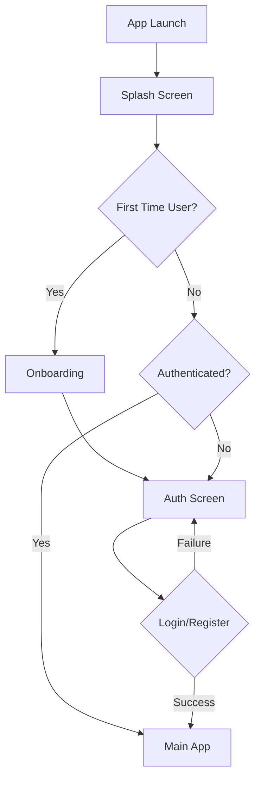

# Design Document: Real Estate Mobile App

## Overview

This design outlines a cross-platform mobile real estate application built with Expo and React Native. The application provides an intuitive, modern interface for property discovery, listing management, and user interaction in the Chilean real estate market. The architecture emphasizes scalability, maintainability, and preparation for future backend integration while delivering a complete MVP experience with simulated data.

## Architecture

### High-Level Architecture

```
┌─────────────────────────────────────────────────────────────┐
│                    Presentation Layer                       │
├─────────────────────────────────────────────────────────────┤
│  Screens  │  Components  │  Navigation  │  Theme System    │
├─────────────────────────────────────────────────────────────┤
│                    Business Logic Layer                     │
├─────────────────────────────────────────────────────────────┤
│   Hooks   │   Services   │   State Mgmt │   Utils          │
├─────────────────────────────────────────────────────────────┤
│                    Data Layer                               │
├─────────────────────────────────────────────────────────────┤
│  Mock Data │  Data Models │  API Interfaces │ Local Storage │
├─────────────────────────────────────────────────────────────┤
│                    Platform Layer                           │
├─────────────────────────────────────────────────────────────┤
│    Expo SDK    │    React Native    │    Native Modules    │
└─────────────────────────────────────────────────────────────┘
```

### Project Structure

```
src/
├── screens/           # Screen components
│   ├── auth/         # Authentication screens
│   ├── home/         # Home and map screens
│   ├── property/     # Property detail screens
│   ├── dashboard/    # User dashboard screens
│   └── onboarding/   # Splash and intro screens
├── components/       # Reusable UI components
│   ├── common/       # Generic components
│   ├── map/          # Map-specific components
│   ├── property/     # Property-related components
│   └── forms/        # Form components
├── navigation/       # Navigation configuration
├── data/            # Mock data and models
│   ├── models/      # TypeScript interfaces
│   ├── mock/        # Simulated data
│   └── api/         # API interface definitions
├── hooks/           # Custom React hooks
├── services/        # Business logic services
├── theme/           # Design system and styling
├── utils/           # Utility functions
└── constants/       # App constants
```

## Components and Interfaces

### Core Components

#### MapView Component
```typescript
interface MapViewProps {
  properties: Property[];
  userLocation: Location;
  onPropertySelect: (property: Property) => void;
  onRegionChange: (region: Region) => void;
  selectedProperty?: Property;
}
```

**Responsibilities:**
- Render Google Maps with property pins
- Handle pin state transitions (normal/active)
- Manage map region changes
- Integrate with geolocation services

#### PropertyPin Component
```typescript
interface PropertyPinProps {
  property: Property;
  isActive: boolean;
  onPress: () => void;
}
```

**States:**
- Normal: Shows icon + price
- Active: Shows circular property photo

#### BottomSheet Component
```typescript
interface BottomSheetProps {
  properties: Property[];
  onPropertySelect: (property: Property) => void;
  snapPoints: string[];
}
```

**Features:**
- Swipe gestures for expand/collapse
- Property list with cards
- Smooth animations

#### PropertyCard Component
```typescript
interface PropertyCardProps {
  property: Property;
  onPress: () => void;
  showDistance?: boolean;
}
```

**Content:**
- Property image
- Price and type
- Distance from user
- Publication status

### Navigation Structure

```typescript
type RootStackParamList = {
  Splash: undefined;
  Onboarding: undefined;
  Auth: undefined;
  Main: undefined;
  PropertyDetail: { propertyId: string };
};

type MainTabParamList = {
  Home: undefined;
  Search: undefined;
  Dashboard: undefined;
  Profile: undefined;
};
```

### Authentication Flow



## Data Models

### Property Model
```typescript
interface Property {
  id: string;
  title: string;
  description: string;
  price: number;
  currency: 'CLP' | 'USD';
  type: 'house' | 'apartment' | 'land';
  operation: 'sale' | 'rent';
  location: {
    latitude: number;
    longitude: number;
    address: string;
    city: string;
    region: string;
  };
  features: {
    bedrooms?: number;
    bathrooms?: number;
    area: number;
    parkingSpots?: number;
  };
  images: string[];
  contact: ContactInfo;
  publishedAt: Date;
  expiresAt?: Date;
  status: 'active' | 'expired' | 'sold' | 'rented';
  isPremium: boolean;
}
```

### User Model
```typescript
interface User {
  id: string;
  email: string;
  name: string;
  avatar?: string;
  userType: 'individual' | 'agent' | 'company';
  subscription: {
    type: 'free' | 'premium';
    expiresAt?: Date;
  };
  properties: string[]; // Property IDs
  savedProperties: string[]; // Favorited property IDs
  createdAt: Date;
}
```

### Location and Map Models
```typescript
interface Location {
  latitude: number;
  longitude: number;
}

interface Region extends Location {
  latitudeDelta: number;
  longitudeDelta: number;
}

interface MapBounds {
  northEast: Location;
  southWest: Location;
}
```

## Services Architecture

### LocationService
```typescript
class LocationService {
  getCurrentLocation(): Promise<Location>;
  watchLocation(callback: (location: Location) => void): () => void;
  requestPermissions(): Promise<boolean>;
}
```

### PropertyService
```typescript
class PropertyService {
  getPropertiesInBounds(bounds: MapBounds): Promise<Property[]>;
  searchProperties(query: SearchQuery): Promise<Property[]>;
  getPropertyById(id: string): Promise<Property>;
  createProperty(property: CreatePropertyRequest): Promise<Property>;
  updateProperty(id: string, updates: Partial<Property>): Promise<Property>;
}
```

### AuthService
```typescript
class AuthService {
  login(email: string, password: string): Promise<AuthResult>;
  register(userData: RegisterRequest): Promise<AuthResult>;
  loginWithSocial(provider: 'google' | 'apple' | 'facebook'): Promise<AuthResult>;
  logout(): Promise<void>;
  getCurrentUser(): Promise<User | null>;
}
```

### State Management

Using React Context + useReducer for global state:

```typescript
interface AppState {
  user: User | null;
  properties: Property[];
  selectedProperty: Property | null;
  mapRegion: Region;
  searchFilters: SearchFilters;
  loading: boolean;
  error: string | null;
}
```

## Theme System

### Color Palette
```typescript
const colors = {
  primary: '#0F2A44',      // Deep blue
  secondary: '#4CAF93',    // Soft green
  accent: '#FF6B5A',       // Coral
  background: '#FFFFFF',
  surface: '#F8F9FA',
  text: {
    primary: '#1A1A1A',
    secondary: '#6B7280',
    light: '#9CA3AF',
  },
  border: '#E5E7EB',
  success: '#10B981',
  warning: '#F59E0B',
  error: '#EF4444',
};
```

### Typography
```typescript
const typography = {
  h1: { fontSize: 32, fontWeight: '700', lineHeight: 40 },
  h2: { fontSize: 24, fontWeight: '600', lineHeight: 32 },
  h3: { fontSize: 20, fontWeight: '600', lineHeight: 28 },
  body1: { fontSize: 16, fontWeight: '400', lineHeight: 24 },
  body2: { fontSize: 14, fontWeight: '400', lineHeight: 20 },
  caption: { fontSize: 12, fontWeight: '400', lineHeight: 16 },
};
```

### Spacing System
```typescript
const spacing = {
  xs: 4,
  sm: 8,
  md: 16,
  lg: 24,
  xl: 32,
  xxl: 48,
};
```

## User Experience Design

### Gesture Interactions

1. **Map Interactions:**
   - Pan: Navigate map
   - Pinch: Zoom in/out
   - Tap: Select property pin
   - Long press: Drop custom pin (future feature)

2. **Bottom Sheet:**
   - Swipe up: Expand sheet
   - Swipe down: Collapse sheet
   - Drag handle: Resize sheet

3. **Property Cards:**
   - Tap: Open property details
   - Long press: Quick actions menu
   - Swipe left: Save property
   - Swipe right: Share property

### Animation System

Using React Native Reanimated 3:

```typescript
// Pin state transition
const pinScale = useSharedValue(1);
const pinOpacity = useSharedValue(1);

const animatePin = (isActive: boolean) => {
  pinScale.value = withSpring(isActive ? 1.2 : 1);
  pinOpacity.value = withTiming(isActive ? 0.9 : 1);
};
```

### Haptic Feedback

```typescript
enum HapticType {
  Light = 'light',
  Medium = 'medium',
  Heavy = 'heavy',
  Success = 'success',
  Warning = 'warning',
  Error = 'error',
}

const triggerHaptic = (type: HapticType) => {
  Haptics.impactAsync(Haptics.ImpactFeedbackStyle[type]);
};
```

## Screen Specifications

### Splash Screen
- Animated logo with brand colors
- 2-3 second duration
- Smooth transition to onboarding/main app

### Onboarding Screens
1. **Screen 1:** "Encuentra tu hogar ideal"
2. **Screen 2:** "Publica gratis por 30 días"
3. **Screen 3:** "Conecta con compradores y vendedores"

### Home Screen Layout
```
┌─────────────────────────────────────┐
│ [Search Bar]              [Avatar]  │
├─────────────────────────────────────┤
│                                     │
│           Google Maps               │
│         with Property Pins          │
│                                     │
├─────────────────────────────────────┤
│ [Filter Button]    [Location Button]│
└─────────────────────────────────────┘
```

### Property Detail Screen
- Image carousel with indicators
- Property information sections
- Mini-map with property location
- Contact information
- Action buttons (Save, Share, Contact)

### Dashboard Screen
- User profile summary
- Subscription status indicator
- Property listings grid
- Add property floating action button

## Mock Data Strategy

### Data Generation
```typescript
// Generate realistic Chilean addresses
const generateMockProperties = (count: number): Property[] => {
  const chileanCities = ['Santiago', 'Valparaíso', 'Concepción', 'La Serena'];
  const propertyTypes = ['house', 'apartment', 'land'];
  
  return Array.from({ length: count }, (_, index) => ({
    id: `prop_${index}`,
    title: `Propiedad ${index + 1}`,
    // ... generate realistic data
  }));
};
```

### Regional Data
- Focus on major Chilean cities
- Realistic price ranges in CLP
- Authentic neighborhood names
- Proper Chilean address formats

## Future Integration Preparation

### API Interface Design
```typescript
interface APIClient {
  auth: AuthAPI;
  properties: PropertyAPI;
  users: UserAPI;
  payments: PaymentAPI;
  chat: ChatAPI;
}

// Prepared for backend integration
const apiClient = createAPIClient({
  baseURL: __DEV__ ? 'http://localhost:3000' : 'https://api.realestate.cl',
  timeout: 10000,
});
```

### Feature Flags
```typescript
const featureFlags = {
  enableChat: false,
  enablePayments: false,
  enablePushNotifications: false,
  enableAdvancedFilters: true,
};
```

## Correctness Properties

*A property is a characteristic or behavior that should hold true across all valid executions of a system—essentially, a formal statement about what the system should do. Properties serve as the bridge between human-readable specifications and machine-verifiable correctness guarantees.*

Based on the prework analysis, I've identified properties that can be combined and consolidated to eliminate redundancy. Here are the essential correctness properties for the real estate mobile application:

### Property 1: Authentication System Validation
*For any* valid email and password combination, the authentication system should successfully create an account and log the user in, and for any invalid credentials, it should display appropriate error messages without granting access.
**Validates: Requirements 1.4, 1.5, 1.6**

### Property 2: Map Centering and Pin Display
*For any* user location and set of properties, the map should center on the user's location and display pins for all properties within the visible map bounds.
**Validates: Requirements 2.2, 2.3, 2.7**

### Property 3: Pin State Management
*For any* property pin, it should display icon and price in normal state, and transform to show circular photo when selected, with proper highlighting and information display on tap.
**Validates: Requirements 2.4, 2.5, 2.6**

### Property 4: Search and Filter Consistency
*For any* search terms and filter combinations, the application should filter properties consistently across map view and list view, and clearing filters should restore the complete property set.
**Validates: Requirements 3.2, 3.4, 3.5**

### Property 5: Property List Display Completeness
*For any* property in the bottom sheet list, the property card should include all required information (image, price, type, distance, publication status) and navigate to detail view when tapped.
**Validates: Requirements 4.2, 4.3, 4.4**

### Property 6: Property Detail Information Completeness
*For any* property detail screen, it should display photo gallery, mini-map with location, and contact information when available.
**Validates: Requirements 5.1, 5.2, 5.3**

### Property 7: Dashboard Property Management
*For any* user with property listings, the dashboard should display all their properties with correct subscription status and remaining days for free listings.
**Validates: Requirements 6.1, 6.2, 6.3**

### Property 8: Freemium Model Enforcement
*For any* new user creating their first listing, they should receive 30 days free publication, and when free listings expire, payment should be required to continue.
**Validates: Requirements 7.1, 7.2**

### Property 9: Premium Feature Access
*For any* user who upgrades to premium, additional features and extended listing periods should be unlocked immediately.
**Validates: Requirements 7.3**

### Property 10: Gesture and Interaction Response
*For any* supported gesture (swipe, drag, tap, long press), the application should respond appropriately with haptic feedback and proper state changes.
**Validates: Requirements 8.1, 8.2**

### Property 11: Loading and Error State Management
*For any* content loading operation or error condition, the application should display appropriate loading states or user-friendly error messages.
**Validates: Requirements 8.4, 8.5**

### Property 12: Color Scheme Consistency
*For any* UI element, the application should use the correct colors from the defined palette (primary #0F2A44, secondary #4CAF93, accent #FF6B5A) according to their designated purposes.
**Validates: Requirements 9.1, 9.2, 9.3**

### Property 13: Accessibility and Readability
*For any* text content displayed, the application should maintain appropriate contrast ratios and typography for readability.
**Validates: Requirements 9.5**

### Property 14: Navigation Consistency
*For any* navigation action throughout the app, the navigation system should behave consistently and predictably.
**Validates: Requirements 10.3**

## Error Handling

### Error Categories

1. **Network Errors:**
   - Connection timeout
   - No internet connection
   - Server unavailable
   - API rate limiting

2. **Authentication Errors:**
   - Invalid credentials
   - Expired sessions
   - Social login failures
   - Account creation conflicts

3. **Location Errors:**
   - Permission denied
   - Location unavailable
   - GPS disabled
   - Location timeout

4. **Data Validation Errors:**
   - Invalid property data
   - Missing required fields
   - File upload failures
   - Image processing errors

### Error Handling Strategy

```typescript
interface ErrorHandler {
  handleNetworkError(error: NetworkError): void;
  handleAuthError(error: AuthError): void;
  handleLocationError(error: LocationError): void;
  handleValidationError(error: ValidationError): void;
}

// Global error boundary for React components
class GlobalErrorBoundary extends React.Component {
  componentDidCatch(error: Error, errorInfo: ErrorInfo) {
    // Log error and show user-friendly message
    ErrorService.logError(error, errorInfo);
    this.setState({ hasError: true });
  }
}
```

### User-Friendly Error Messages

- **Spanish language** for Chilean market
- **Clear, actionable** instructions
- **Retry mechanisms** where appropriate
- **Fallback content** when possible

## Testing Strategy

### Dual Testing Approach

The application will use both unit testing and property-based testing to ensure comprehensive coverage:

**Unit Tests:**
- Specific examples and edge cases
- Component rendering and behavior
- Navigation flows
- Error conditions
- Integration between components

**Property Tests:**
- Universal properties across all inputs
- Comprehensive input coverage through randomization
- Validation of correctness properties defined above
- Minimum 100 iterations per property test

### Property-Based Testing Configuration

**Testing Library:** We will use **fast-check** for JavaScript/TypeScript property-based testing, integrated with Jest.

**Test Configuration:**
- Minimum 100 iterations per property test
- Each property test references its design document property
- Tag format: **Feature: real-estate-mobile-app, Property {number}: {property_text}**

**Example Property Test Structure:**
```typescript
import fc from 'fast-check';

describe('Authentication System', () => {
  it('should validate credentials correctly', () => {
    // Feature: real-estate-mobile-app, Property 1: Authentication System Validation
    fc.assert(fc.property(
      fc.emailAddress(),
      fc.string({ minLength: 8 }),
      (email, password) => {
        const result = authService.validateCredentials(email, password);
        expect(result.isValid).toBeDefined();
        if (result.isValid) {
          expect(result.user).toBeDefined();
        } else {
          expect(result.error).toBeDefined();
        }
      }
    ), { numRuns: 100 });
  });
});
```

### Testing Scope

**Unit Testing Focus:**
- Component rendering with various props
- User interaction handling
- Form validation
- Navigation behavior
- Mock service integration

**Property Testing Focus:**
- Authentication flows with various inputs
- Map functionality with different locations and property sets
- Search and filtering with various queries
- Data consistency across app states
- UI color and accessibility compliance

**Integration Testing:**
- End-to-end user flows
- Screen transitions
- Data persistence
- Error recovery scenarios

### Mock Data Testing

All tests will use structured mock data that mirrors the expected API responses:

```typescript
const mockPropertyGenerator = fc.record({
  id: fc.uuid(),
  title: fc.string({ minLength: 5, maxLength: 100 }),
  price: fc.integer({ min: 50000000, max: 2000000000 }), // CLP range
  type: fc.constantFrom('house', 'apartment', 'land'),
  location: fc.record({
    latitude: fc.float({ min: -56, max: -17 }), // Chile bounds
    longitude: fc.float({ min: -109, max: -66 }),
  }),
  // ... other property fields
});
```

This comprehensive testing strategy ensures that both specific scenarios and general behaviors are validated, providing confidence in the application's correctness and reliability.